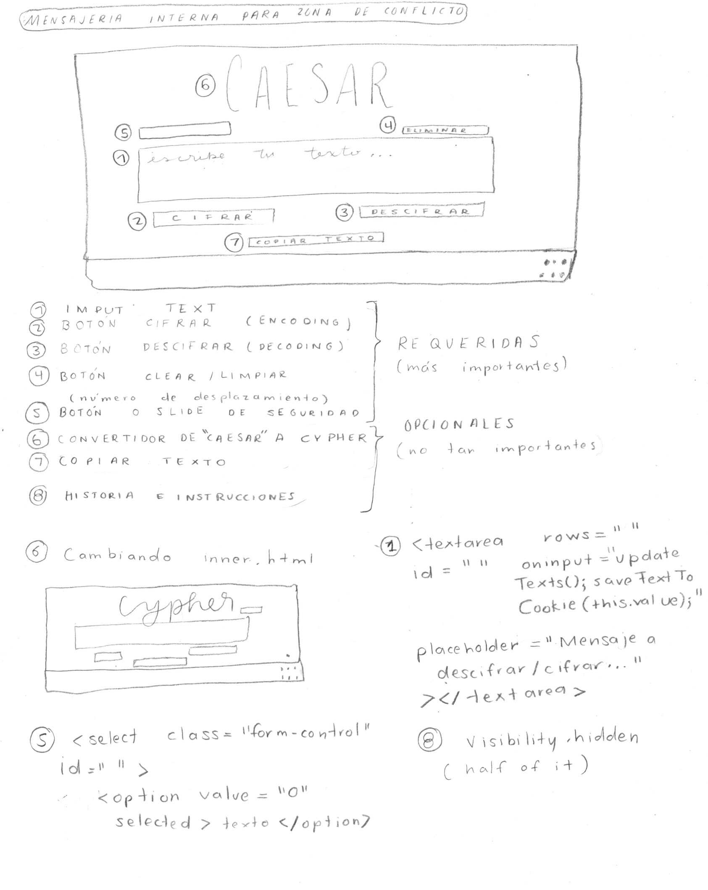

# Caesar Cipher

## Índex

- [1. Objective](#1-objective)
- [2. Project Summary](#2-project-summary)
- [3. Learnt Skills](#3-learnt-skills)
- [4. Prototypes](#4-prototypes)
- [5. Project Functions](#5-proyect-functions)
- [6. Feedback & Testing](#6-feedback-&-testing)

---

## 1. Objective

There is war in the air. The Jewish Forces have allied to develop a way
to send their officers back home their positions and future moves.
However, there was no luck, because their code was just too easy to
crack. They found another way. And you will help with that. You are responsible to send a message
secure enough to prevent the enemy to figure it out.

### History

        In cryptography, a Caesar cipher, also known as Caesar's cipher, the shift cipher, Caesar's code or Caesar shift, is one of the simplest and most widely known encryption techniques. It is a type of substitution cipher in which each letter in the plaintext is replaced by a letter some fixed number of positions down the alphabet. For example, with a left shift of 3, D would be replaced by A, E would become B, and so on. The method is named after Julius Caesar, who used it in his private correspondence.

The transformation can be represented by aligning two alphabets; the cipher alphabet is the plain alphabet rotated left or right by some number of positions. For instance, here is a Caesar cipher using a left rotation of three places, equivalent to a right shift of 23 (the shift parameter is used as the key):

Plain: ABCDEFGHIJKLMNOPQRSTUVWXYZ
Cipher: XYZABCDEFGHIJKLMNOPQRSTUVW

When encrypting, a person looks up each letter of the message in the "plain" line and writes down the corresponding letter in the "cipher" line.

Plaintext: THE QUICK BROWN FOX JUMPS OVER THE LAZY DOG
Ciphertext: QEB NRFZH YOLTK CLU GRJMP LSBO QEB IXWV ALD

## 2. Project Summary

Our goal for this project was to create a platform where the user could enter a text and cipher it,
choosing a level of security: a specific character offset.

My chosen thematic was a war coding platform. Internal letters would be sent around a conflict zone, and the enemy
wouldn't be able to decipher it without using this mechanism.

## 3. Learnt Skills

I had to acquire experience in the following tools to be able to create this platform:
-HTML5
-CCS3 and
-JavaScript

Objectives I got to **understand** y **apply** for my project:

### UX

- [x] Diseñar la aplicación pensando y entendiendo al usuario.
- [x] Crear prototipos para obtener feedback e iterar.
- [ ] Aplicar los principios de diseño visual (contraste, alineación, jerarquía).

### HTML y CSS

- [x] Uso de HTML semántico.
- [x] Uso de selectores de CSS.
- [x] Construir tu aplicación respetando el diseño realizado (maquetación).

### DOM

- [ ] Uso de selectores del DOM.
- [x] Manejo de eventos del DOM.
- [x] Manipulación dinámica del DOM.

### Javascript

- [x] Manipulación de strings.
- [x] Uso de condicionales (if-else | switch).
- [x] Uso de bucles.
- [x] Uso de funciones (parámetros | argumentos | valor de retorno).
- [x] Declaración de variables (const & let).

### Testing

- [x] Testeo de tus funciones.

### Git y GitHub

- [x] Comandos de git (add | commit | pull | status | push).
- [x] Manejo de repositorios de GitHub (clone | fork | gh-pages).

### ESLint y Sintaxis

- [ ] Uso de identificadores descriptivos (Nomenclatura | Semántica).
- [ ] Uso de linter (ESLint).

## 4. Prototypes

Sketched prototype

Graphic prototype using Figma.

<iframe style="border: none;" width="800" height="450" src="https://www.figma.com/embed?embed_host=share&url=https%3A%2F%2Fwww.figma.com%2Ffile%2F6RCIOvTKPFyibHkIuP4k1I%2FPrototyping-in-Figma%3Fnode-id%3D6%253A394" allowfullscreen></iframe>

## 5. Project Functions

The user will be able to:

- Chose an offset of how many positions we want our text to be displaced.
- Insert message the user wishes to cipher.
- See ciphered message in the second text-box.
- Copy ciphered text.
- Clear both text-boxes to add a new message.
- Add ciphered message in the second text-box to decipher.
- See deciphered message in the first text-box.
- Read more about ciphering in Wikipedia by clicking the icon on footer.

## 6. Feedback & Testing

### Feedback Received

After I felt that my platform was concluded, I asked my teammates to give me specific feedback of my platform. Here are some of the things I agreed were important changes I had to make to my page.

- [x] erase alert of security level once you do add a security level.
- [] move instruction #7 to a comment when you click decipher.
- [x] change button arrangement and color.
- [] display(create invisible divisions to substitute scrolling)
- [] make a more dynamic platform.

### Testing

Scanned 1 files, no errors found (26 ms).

> cipher@1.0.0 test /home/laboratoria-175/proyectos/GDL004-cipher
> jest --verbose --coverage

PASS test/cipher.spec.js
cipher
✓ debería ser un object (3ms)
cipher.encode
✓ debería ser una función (1ms)
✓ debería retornar "HIJKLMNOPQRSTUVWXYZABCDEFG" para "ABCDEFGHIJKLMNOPQRSTUVWXYZ" con offset 33 (1ms)
✓ debería retornar " !@" para " !@"
cipher.decode
✓ debería ser una función
✓ debería retornar "ABCDEFGHIJKLMNOPQRSTUVWXYZ" para "HIJKLMNOPQRSTUVWXYZABCDEFG" con offset 33
✓ debería retornar " !@" para " !@" (1ms)

-----------|----------|----------|----------|----------|-------------------|
File | % Stmts | % Branch | % Funcs | % Lines | Uncovered Line #s |
-----------|----------|----------|----------|----------|-------------------|
All files | 100 | 100 | 100 | 100 | |
cipher.js | 100 | 100 | 100 | 100 | |
-----------|----------|----------|----------|----------|-------------------|
Test Suites: 1 passed, 1 total
Tests: 7 passed, 7 total
Snapshots: 0 total
Time: 1.436s
Ran all test suites.
